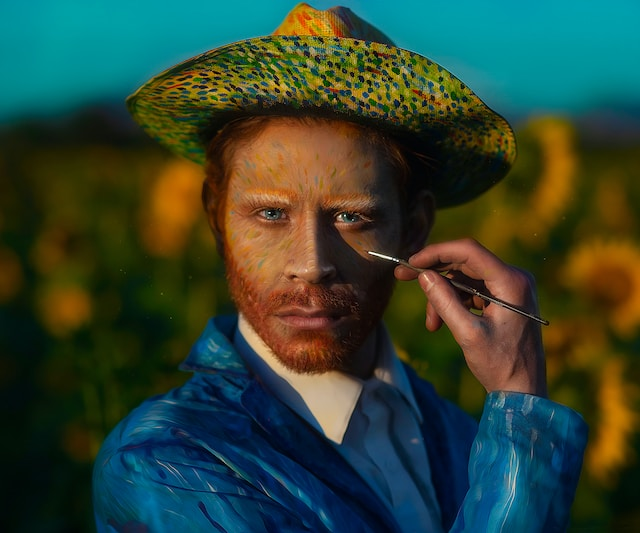
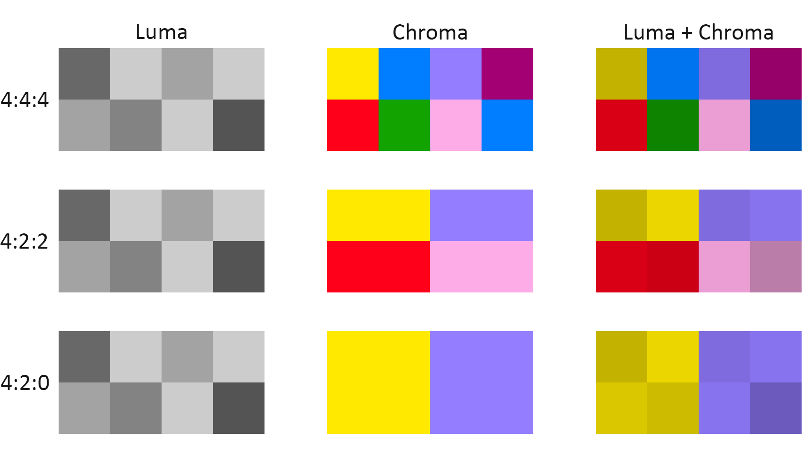
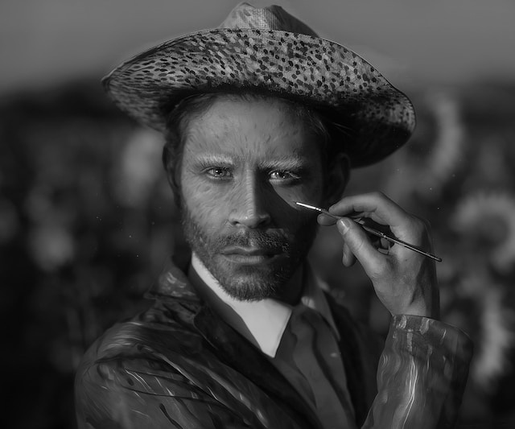
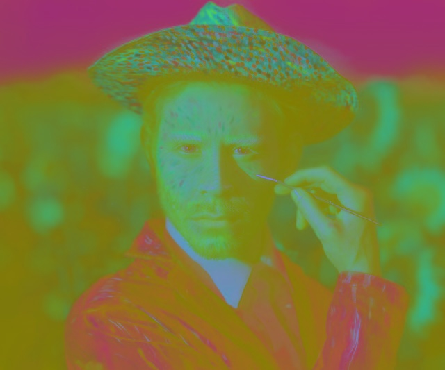
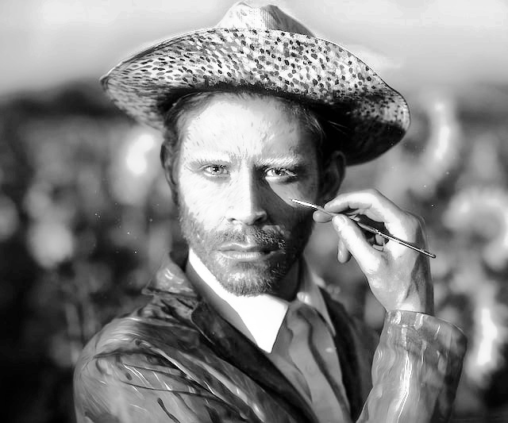
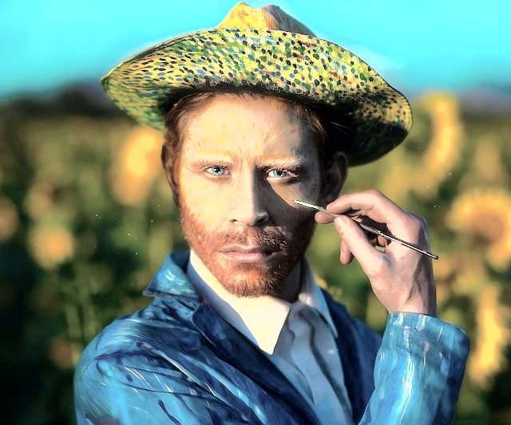

<h1><center>Visión Computacional</center></h1>
<center style="display: flex; justify-content: space-between;">
  
    <ul style="list-style-type: none;">
      <li><i>Universidad Autónoma de San Luis Potosí</i></li>
      <li><i>Facultad de Ingeniería</i></li>
      <li><i>Parcial 1</i></li>
      <li><i>Angel de Jesús Maldonado Juárez</i></li>
      <li><i>Tarea 1: Procesamiento digital de imágenes</i></li>
      <li><i>Fecha de entrega: <b>12 de septiembre del 2023</b></i></li>
    </ul>
    
  </center>
<hr>

## Procesamiento de imagen
La imagen a procesar será la siguiente:

<center>
    
</center>

Las transformaciones que se le realizarán a la imagen son las siguientes:

1. Cambio de la imagen a escala de grises.
2. Ecualización del histograma de la imagen en
escala de grises.
3. Ecualización del histograma de la imagen
original (en el espacio *YCrCb*).

## Escala de grises

Para cambiar la imagen en formato *RGB* a *Escala de grises*
se utiliza la función `cvtColor()`:

```python
img = cv.imread('../img/original.jpg')
img_gray = cv.cvtColor(img, cv.COLOR_BGR2GRAY)
```

Donde `img` es la variable que almacenará la información
de la imagen original (leída fon la función `imread()`).
la constante `cv.COLOR_BGR2GRAY` indica que la imagen
será convertida a escala de grises, y es almacenada en la
variale `img_gray`.

Posteriormente, para guardar la imagen modificada se utiliza
la función `imwrite()`:

```python
cv.imwrite('../img/grayscale.jpg', img_gray)
```

Para la ecualización del histograma de la imagen en escala
de grises se utiliza la función `equalizeHist()`:

```python
img_gray_eq = cv.equalizeHist(img_gray)
```

## Espacio de color *YCrCb*

El espacio de color *YCrCb* está compuesto por tres
componentes: luminancia (*Y*), crominancia roja (*Cr*), y
crominancia azul (*Cb*).

Este espacio de color es utilizado en compresiones de
imágenes, y formatos de video como *MPEG* y *JPEG*. Además,
cabe mencionar que sus formatos son digitales, mientras que
el formato *YCbCr* es analógico.

A nivel de pixeles, la conjunción de cada componente puede
visualizarse de la siguiente manera:

<center>
  
  <p><i>
    Chroma Subsampling (Fuente: <a href="https://www.haivision.com/glossary/chroma-subsampling/#:~:text=Chroma%20subsampling%20is%20a%20type,without%20significantly%20affecting%20picture%20quality.">Haivision</a>)
  </i></p>
</center>

*Luma* es el componente de *Luminancia* (*Y*), mientras que
*Chroma* es la conjunción de los componentes de *Crominancia*
(*Cr* y *Cb*). Las escalas que se manejan son de acuerdo a
la proporción que se utiliza de cada comonente en el espacio
*YCrCb*:

- *4:4:4*: mantiene la luminancia y colores tal cual.
- *4:2:2*: tiene la mitad de crominancia que el *4:4:4* y
reduce el ancho de banda en un 30%.
- *4:2:0*: tiene 1/4 de crominancia que el *4:4:4* y reduce
el ancho de banda en un 50%.

Este espacio de color está basado en el **submuestreo de
crominancias**, el cual consiste en reducir la información
de color de una señal para reducir el peso de una imagen.

Cuando una imagen en formato *RGB* es convertida a *YCrCb*,
se obtiene una imagen en escala de grises (*Y*), y dos
componentes de crominancia (*Cr* y *Cb*).

Al igual que en el caso anterior, para cambiar la imagen en
formato *RGB* a *YCrCb* se utiliza la función `cvtColor()`:

```python
img_YCrCb = cv.cvtColor(img, cv.COLOR_BGR2YCrCb)
```

Para la ecualización del histograma de la imagen en el
espacio de color *YCrCb* también se utiliza la función
`equalizeHist()`:

```python
img_YCrCb[:,:,0] = cv.equalizeHist(img_YCrCb[:,:,0])
```

La diferencia en este caso es que se debe especificar el
canal de la imagen que se desea ecualizar, en este caso
el canal *Y*, con la sintaxis `img_YCrCb[:,:,0]`.

Finalmente, para una mejor visualización de la ecualización,
se convierte la imagen de *YCrCb* a *RGB*:

```python
img_YCrCb_eq = cv.cvtColor(img_YCrCb, cv.COLOR_YCrCb2BGR)
```

## Ecualización en *escala de grises* vs *YCrCb*

### Imágenes transformadas

<center style="display: flex;">
  <div>
    
    <p><i>Imagen en blanco y negro</i></p>
  </div>
  <div>
    
    <p><i>Imagen en espacio YCrCb</i></p>
  </div>
</center>

### Imágenes ecualizadas

<center style="display: flex;">
  <div>
    
    <p><i>Imagen en blanco y negro ecualizada</i></p>
  </div>
  <div>
    
    <p><i>Imagen en YCrCb ecualizada</i></p>
  </div>
</center>

### Imagen original vs Imagen ecualizada (blanco y negro)

<center style="display: flex;">
  <div>
    
    <p><i>Imagen en blanco y negro</i></p>
  </div>
  <div>
    
    <p><i>Imagen ecualizada</i></p>
  </div>
</center>

### Imagen original vs Imagen ecualizada (espacio *YCrCb*)

<center style="display: flex;">
  <div>
    
    <p><i>Imagen original</i></p>
  </div>
  <div>
    
    <p><i>Imagen ecualizada</i></p>
  </div>
</center>

## Código fuente en *Python*

```python
"""
Universidad Autónoma de San Luis Potosí
Facultad de Ingeniería
Visión Computacional

Autor: Angel de Jesús Maldonado Juárez
Fecha de Creación: 11 de septiembre de 2023

Descripción:
Transformación de una imgen a escala de grises, y espacio de colores
YCrCb
"""

## Importación de librerías
import cv2 as cv

## Lectura de la imgen
img = cv.imread('../img/original.jpg')
## Transformación a escala de grises
img_gray = cv.cvtColor(img, cv.COLOR_BGR2GRAY)
## Guardado de la imagen
cv.imwrite('../img/grayscale.jpg', img_gray)
## Ecualización de la imagen en escala de grises
img_gray_eq = cv.equalizeHist(img_gray)
## Guardado de la imagen ecualizada
cv.imwrite('../img/grayscale_eq.jpg', img_gray_eq)

## Transformación a espacio de colores YCrCb
img_YCrCb = cv.cvtColor(img, cv.COLOR_BGR2YCrCb)
## Guardado de la imagen
cv.imwrite('../img/YCrCb.jpg', img_YCrCb)
## Ecualización de la imagen en el componente Y
img_YCrCb[:,:,0] = cv.equalizeHist(img_YCrCb[:,:,0])
## Transformación a espacio de colores BGR
img_YCrCb_eq = cv.cvtColor(img_YCrCb, cv.COLOR_YCrCb2BGR)
## Guardado de la imagen ecualizada
cv.imwrite('../img/YCrCb_eq.jpg', img_YCrCb_eq)

```

## Referencias

- [Chroma Subsampling - Haivision](https://www.haivision.com/glossary/chroma-subsampling/#:~:text=Chroma%20subsampling%20is%20a%20type,without%20significantly%20affecting%20picture%20quality.)

- [Sattarova Feruza, Y., & Kim, T. H. (2009). Review on YCrCb color space optimization, TV images compression, Algorithm of Signals Sources Isolation and Optical Fiber. International Journal of Smart Home, 3(4).](https://citeseerx.ist.psu.edu/document?repid=rep1&type=pdf&doi=59b1bcffb36247545ecc75428618dea059c21a2e)
