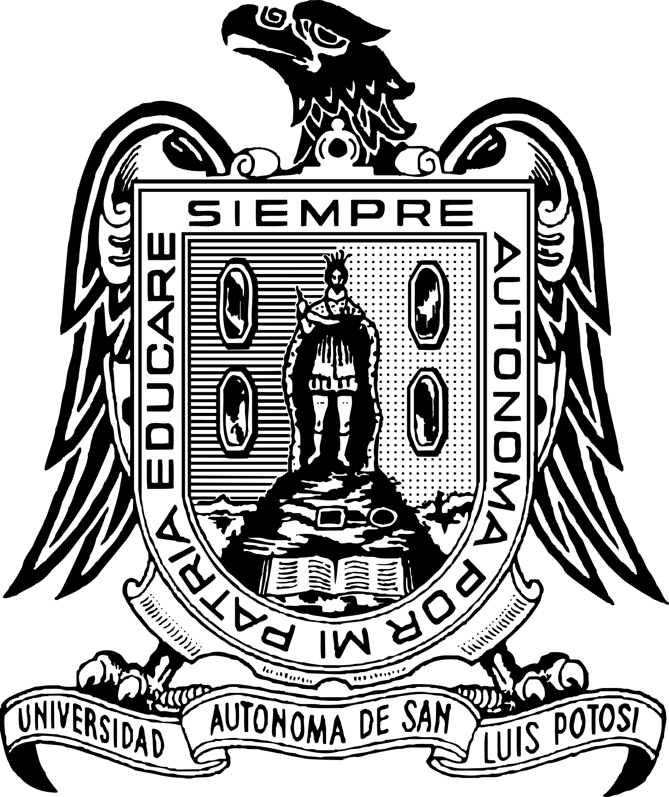
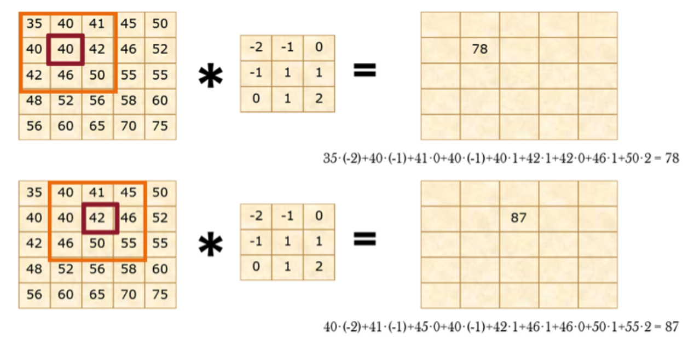
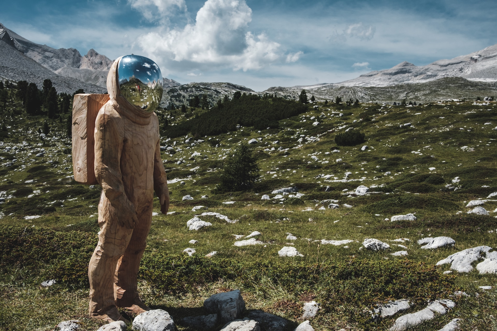
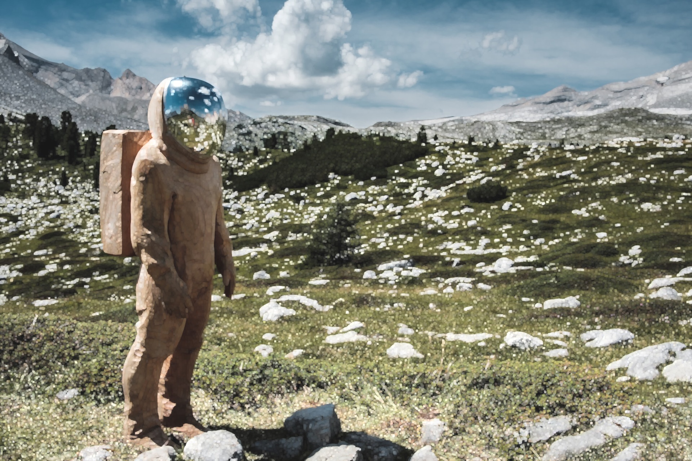
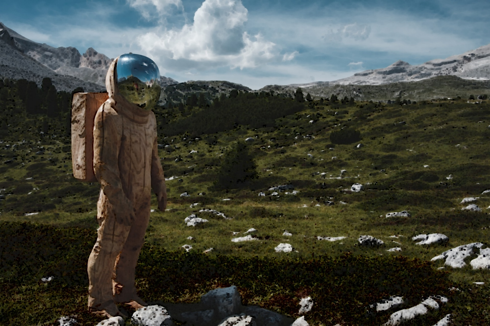
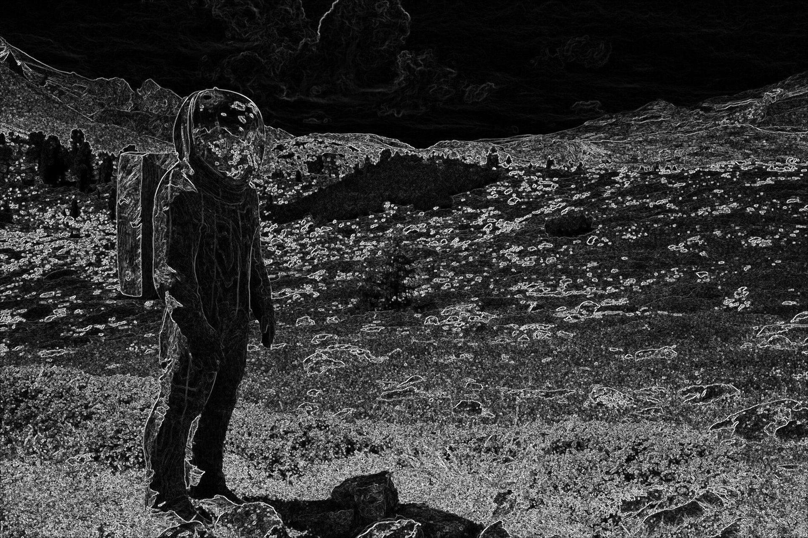

<h1><center>Visión Computacional</center></h1>
<center style="display: flex; justify-content: space-between;">
  
    <ul style="list-style-type: none;">
      <li><i>Universidad Autónoma de San Luis Potosí</i></li>
      <li><i>Facultad de Ingeniería</i></li>
      <li><i>Parcial 1</i></li>
      <li><i>Angel de Jesús Maldonado Juárez</i></li>
      <li><i>Tarea 2: Filtros de Convolución</i></li>
      <li><i>Fecha de entrega: <b>14 de septiembre del 2023</b></i></li>
    </ul>
    
  </center>
<hr>

## Filtros convolucionales

Un píxel de imagen consta de tres elementos: su *coordenada
en x*, *coordenada en y*, y la *intensidad*. Matemáticamene:
$z=F(x,y)$, donde $z$ es la *intensidad*, y $x$ e $y$ las
coordenada espaciales en donde se encuentra el píxel dentro
de la imagen. Por lo tanto, una imagen pude ser representada
como una matriz de píxeles, el tamaño (orden) de la matriz
sería la *resolución* de la imagen, y cada número número que
contenga la matriz es la intensidad del píxel.

Un *filtro convolucional* sería definida entonces como una
matriz (también llamada *máscara* o *kernel*), la cual se le
aplicará la operación de *convolución* con la matriz de la
imagen.

$$D=A*C$$

Este proceso puede visualizarse como la multiplicación de
la región de la matriz de imagen por la *máscara* hasta que la
*máscara* haya cubierto toda la matriz de la imagen:

<center>
  
  <p><i>Ejemplo convolución (Fuente: <a href="https://polipapers.upv.es/index.php/MSEL/article/view/4524/4724">MSEL</a>)</i></p>
</center>

## Filtros aplicados en este trabajo

La imagen a la cual se le aplicaron distintos filtros de
convolución es la siguiente:

<center>
  
</center>

Los filtros que se le aplicaron son los siguientes:

- *Bilateral filter*
- *Blur*
- *Dilate*
- *Erode*
- *Gaussian Blur*
- *Median Blur*
- *Spatial Gradient*

## *Bilateral filter*

El filtro bilateral (*Bilateral filter*) utiliza un *kernel
gausiano* tanto en la intensidad como en las coordenadas de la
imagen, lo que ocasiona que las orillas de la imagen se
preserven y sólo los aspectos más finos o poco visibles sean
difuminados.

La función en *Python* que aplica este filtro a una imagen es:

```python
bilateralFilter(img, d, sigmaColor, sigmaSpace)
```

Donde `img` es la imagen, `d` es el diámetro de píxeles que
se va a utilizar durante la convolución (si no se define o es
negativo, se calcula a partir de `sigmaSpace`), `sigmaColor`
es una *desviación estándar* que se aplicará a los colores al
momento de realizar la convolución, `sigmaSpace` también es
una *desviación estándar* que se aplicará a las coordenadas
espaciales (píxeles). Un alto valor de `sigmaColor` o
`sigmaSpace` implicaría una mayor influencia de los píxeles
vecinos basándose en su color.

<center style="display: flex;">
  <div>
    
    <p><i>Imagen original</i></p>
  </div>
  <div>
    
    <p><i>Imagen con Bilateral Filter</i></p>
  </div>
</center>

```python
img_bilateral = cv.bilateralFilter(img, 9, 75, 75)
```

## *Blur*

El filtro *Blur* simplemente aplica la operación de
*suavizado* a la imagen, utilizando una *máscara/kernel*
definida por:

$$
K = \frac{1}{ksize.width*ksize.height}
\begin{bmatrix}
  1 & 1 & ... & 1 \\
  1 & 1 & ... & 1 \\
  ... \\
  1 & 1 & ... & 1
\end{bmatrix}
$$

En la función en *Python* se define el tamaño de la máscara
con el parámetro `ksize`, el cual debe ser un número impar
positivo.

```python
blur(img, ksize)
```

<center style="display: flex;">
  <div>
    
    <p><i>Imagen original</i></p>
  </div>
  <div>
    
    <p><i>Imagen con Blur</i></p>
  </div>
</center>

```python
img_blur = cv.blur(img, (9, 9))
```

## *Dilate*

El efecto de este filtro es que aumenta el tamaño de las
regiones con más brillo, es decir, los píxeles con mayor
intensidad. Esta operación está dada por:

$$
dst(x, y)=max_{(x',y'):elemento(x',y')\neq0}src(x+x',y+y')
$$

La función en *Python* que aplica este filtro a una imagen es:

```python
dilate(img, kernel)
```

Donde `img` es la imagen, y `kernel` es la *máscara* que se le
aplicará a la imagen. Para definir el `kernel` se utiliza la
función `getStructuringElement()`.

```python
kernel = cv.getStructuringElement(cv.MORPH_RECT, (5, 5))
```

En este ejemplo, se utiliza un *kernel* de 5x5 con forma
rectangular.

<center style="display: flex;">
  <div>
    
    <p><i>Imagen original</i></p>
  </div>
  <div>
    
    <p><i>Imagen con Dilate</i></p>
  </div>
</center>

```python
kernel = cv.getStructuringElement(cv.MORPH_RECT, (5, 5))
img_dilate = cv.dilate(img, kernel)
```

## *Erode*

El filtro *Erode* es el opuesto al filtro *Dilate*, es decir,
aumenta el tamaño de las regiones con menor brillo. Esta operación está dada por:

$$
dst(x, y)=min_{(x',y'):elemento(x',y')\neq0}src(x+x',y+y')
$$

La función en *Python* que aplica este filtro a una imagen es:

```python
erode(img, kernel)
```

Al igual que en el filtro *Dilate*, `img` es la imagen, y
`kernel` es la *máscara* la cual también se define con la
función `getStructuringElement()`.

<center style="display: flex;">
  <div>
    
    <p><i>Imagen original</i></p>
  </div>
  <div>
    
    <p><i>Imagen con Erode</i></p>
  </div>
</center>

```python
kernel = cv.getStructuringElement(cv.MORPH_RECT, (5, 5))
img_dilate = cv.erode(img, kernel)
```

## *Gaussian Blur*

A diferencia de *Blur*, el filtro *Gaussian Blur* utiliza una
*máscara/kernel* con valores que siguen una distribución
gausiana, es decir, los valores de la máscara son mayores en
el centro y menores en los extremos. La función en *Python*
que aplica este filtro a una imagen es:

```python
GaussianBlur(img, ksize, sigmaX, sigmaY)
```

Donde `img` es la imagen, `ksize` es el tamaño de la máscara,
`sigmaX` es la *desviación estándar* en la dirección *x*, y
`sigmaY` es la *desviación estándar* en la dirección *y*.

<center style="display: flex;">
  <div>
    
    <p><i>Imagen original</i></p>
  </div>
  <div>
    
    <p><i>Imagen con Gaussian Blur</i></p>
  </div>
</center>
  
```python
img_gaussian = cv.GaussianBlur(img, (9, 9), 0)
```

## *Median Blur*

El filtro *Median Blur* utiliza una *máscara/kernel* que
toma el valor de la mediana de los píxeles que se encuentran
en la región de la máscara. La función en *Python* que aplica
este filtro a una imagen es:

```python
medianBlur(img, ksize)
```

Donde `img` es la imagen, y `ksize` es el tamaño de la
*máscara*.

<center style="display: flex;">
  <div>
    
    <p><i>Imagen original</i></p>
  </div>
  <div>
    
    <p><i>Imagen con Median Blur</i></p>
  </div>
</center>
  
```python
img_median = cv.medianBlur(img, 9)
```

## *Spatial Gradient*

El filtro *Spatial Gradient* es utilizado para detectar los
bordes de una imagen. Funciona aplicando dos filtros
convolucionales, uno en la dirección *x* y otro en la
dirección *y*, y luego se calcula la magnitud de los dos
resultados. La función en *Python* que aplica este filtro a
una imagen es:

```python
spatialGradient(img, dx, dy, ksize, border)
```

Donde `img` es la imagen, `dx` es el orden de la derivada en
la dirección *x*, `dy` es el orden de la derivada en la
dirección *y*, `ksize` es el tamaño de la *máscara*, y
`border` es el tipo de borde que se utilizará en la imagen.

<center style="display: flex;">
  <div>
    
    <p><i>Imagen original</i></p>
  </div>
  <div>
    
    <p><i>Imagen con Spatial Gradient</i></p>
  </div>
</center>
    
```python
dx, dy = cv.spatialGradient(cv.cvtColor(img, cv.COLOR_BGR2GRAY))
abs_grad_x = cv.convertScaleAbs(dx)
abs_grad_y = cv.convertScaleAbs(dy)
img_spatial = cv.addWeighted(abs_grad_x, 0.5, abs_grad_y, 0.5, 0)
```

## Código fuente en *Python*

```python
"""
Universidad Autónoma de San Luis Potosí
Facultad de Ingeniería
Visión Computacional

Autor: Angel de Jesús Maldonado Juárez
Fecha de Creación: 13 de septiembre de 2023

Descripción: Uso de varios filtros convolucionales
con opencv.
"""

## Importación de librerías
import cv2 as cv

## Lectura de la imgen
img = cv.imread('../img/astronaut.jpg')

## Aplicación del filtro Bilateral
img_bilateral = cv.bilateralFilter(img, 9, 75, 75)

## Aplicación del filtro Blur
img_blur = cv.blur(img, (9, 9))

## Aplicación del filtro Dilate
kernel = cv.getStructuringElement(cv.MORPH_RECT, (5, 5))
img_dilate = cv.dilate(img, kernel)

## Aplicación del filtro Erode
kernel = cv.getStructuringElement(cv.MORPH_RECT, (5, 5))
img_erode = cv.erode(img, kernel)

## Aplicación del filtro GaussianBlur
img_gaussian = cv.GaussianBlur(img, (9, 9), 0)

## Aplicación del filtro MedianBlur
img_median = cv.medianBlur(img, 9)

## Aplicación del filtro SpatialGradient
dx, dy = cv.spatialGradient(cv.cvtColor(img, cv.COLOR_BGR2GRAY))
abs_grad_x = cv.convertScaleAbs(dx)
abs_grad_y = cv.convertScaleAbs(dy)
img_spatial = cv.addWeighted(abs_grad_x, 0.5, abs_grad_y, 0.5, 0)

## Guardado de las imagenes filtradas
cv.imwrite('../img/astronaut_bilateral.jpg', img_bilateral)
cv.imwrite('../img/astronaut_blur.jpg', img_blur)
cv.imwrite('../img/astronaut_dilate.jpg', img_dilate)
cv.imwrite('../img/astronaut_erode.jpg', img_erode)
cv.imwrite('../img/astronaut_gaussian.jpg', img_gaussian)
cv.imwrite('../img/astronaut_median.jpg', img_median)
cv.imwrite('../img/astronaut_spatial.jpg', img_spatial)
```

## Referencias

- [Palomares, F. G., Monsoriu, J. A., & Alemany, E. (2016). Aplicación de la convolución de matrices al filtrado de imágenes. Modelling in Science Education and Learning, 9(1), 97-108.](http://polipapers.upv.es/index.php/MSEL/article/view/4524http://polipapers.upv.es/index.php/MSEL/article/view/4524)

- [Raman, S., & Chaudhuri, S. (2009, March). Bilateral Filter Based Compositing for Variable Exposure Photography. In Eurographics (short papers) (pp. 1-4).](https://www.researchgate.net/profile/Shanmuganathan-Raman-2/publication/242935652_Bilateral_Filter_Based_Compositing_for_Variable_Exposure_Photography/links/0f317536fafefd1c91000000/Bilateral-Filter-Based-Compositing-for-Variable-Exposure-Photography.pdf)

- [Dilate & Erode - OpenCV](https://docs.opencv.org/3.4/db/df6/tutorial_erosion_dilatation.html)

- [Python OpenCV Roberts Edge Detection (Geeks for Geeks)](https://www.geeksforgeeks.org/python-opencv-roberts-edge-detection/)

<script type="text/javascript" src="http://cdn.mathjax.org/mathjax/latest/MathJax.js?config=TeX-AMS-MML_HTMLorMML"></script>
<script type="text/x-mathjax-config">
  MathJax.Hub.Config({ tex2jax: {inlineMath: [['$', '$']]}, messageStyle: "none" });
</script>
